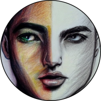

<p align="center">
  
</p>

<h1 align="center">Image to Sketch Converter</h1>

<h3 align="center">Fond of **sketches**, but bad at **art**? 🥴</h3>
<br>

[](https://github.com/samyak-jn/detect/actions/workflows/main.yml)
[](https://results.pre-commit.ci/latest/github/samyak-jn/detect/master)

<a href="https://github.com/python/black"></a>
<a href="https://github.com/samyak-jn/detect/blob/master/LICENSE"></a>


Here's a little something for people like you and me.
This is a simple python script that converts your **captured images** into a **sketch** in real-time with just one line of command, fascinating? 😎

This script is written with the help of the OpenCV library in python.All the sketches will be saved in the parent directory itself.

### Quick Setup

```bash
# Clone the repository
git clone https://github.com/samyak-jn/detect.git
poetry shell
poetry install
sketch_converter --help
```

## Camera Usage

```bash
# video_src = 1 , grayscale mode = 1
sketch_converter video-capture 1 1
```

### Contributing ✔️

- Please contribute using [Github Flow](https://guides.github.com/introduction/flow/). Create a branch, add commits, and [open a pull request](https://github.com/fraction/readme-boilerplate/compare/).

- All the issues/features are welcome. Open a PR and let's have a discussion.

### License
sketch-converter is licensed under [MIT](https://github.com/samyak-jn/detect/blob/master/LICENSE), hence it is open source for all.

---
Copyright © 2023 Onuralp SEZER, Samyak Jain
